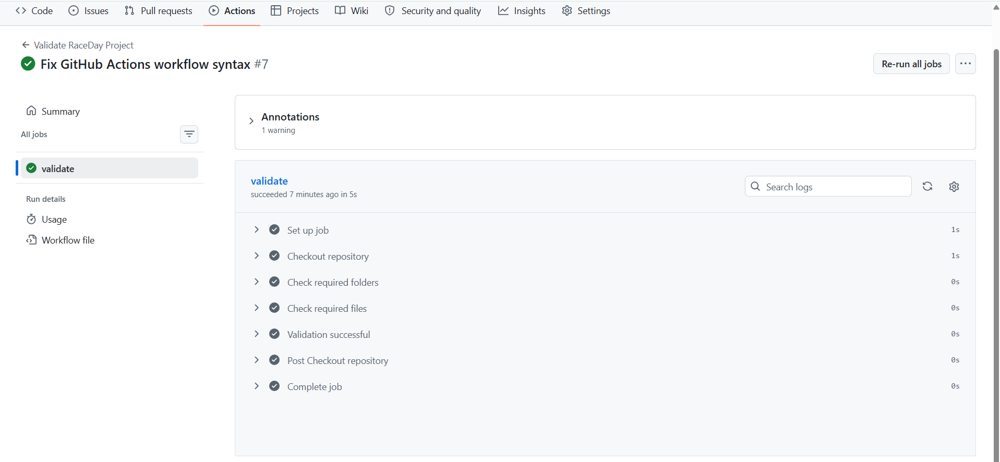

# RaceDay

RaceDay is an event management and race results system designed to allow participants to register for events, select categories, and view their results, while organisers can create and manage events, categories, enrolments and results.

## Project Structure

- `database/` – SQL Server database script
- `docs/` – ERD and API endpoint documentation
- `.github/workflows/` – GitHub Actions workflow for project validation

## User Roles

### Participant
Participants can register for the RaceDay system, manage their profile, view available events, enrol in events by selecting a category, and view their race results.

### Organiser
Organisers can create and manage events and categories, view participant enrolments, and record race results.

## Main Features

- User registration and authentication
- Participant and organiser profiles
- Event management
- Event category management
- Participant enrolments
- Race result management
- Automated GitHub repository validation

## Technologies

- SQL Server
- REST API
- GitHub
- GitHub Actions

## CI/CD Validation

The project uses GitHub Actions to validate the required repository structure and files.

